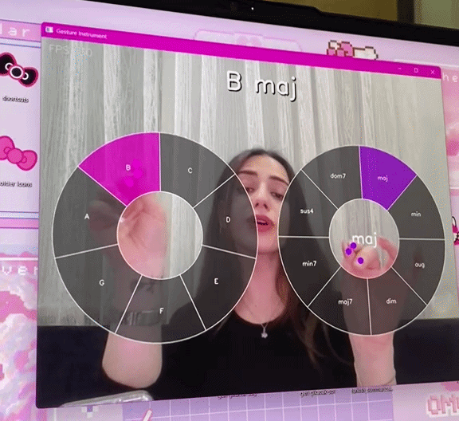

# Gesture Instrument

A real-time, touchless musical instrument that runs entirely on a standard webcam. You play chords by pointing your hands at two radial menus overlaid on the live camera feed — no MIDI controller, no audio interface, no physical contact required.

---



## How It Works

The application captures your webcam feed and tracks both hands simultaneously using a neural network landmark model. Two circular menus are projected onto the video:

- **Left hand** controls the **root note** (C through B)
- **Right hand** controls the **chord quality** (major, minor, augmented, diminished, and four seventh variants)

When both hands hover over a selection at the same time, the corresponding chord is synthesized live and streamed to your speakers. Move your hands to change notes or chord types in real time.

No sound files are used anywhere. Every chord is generated mathematically on the fly by summing sine waves for each note in the chord, shaped with an ADSR envelope.

---

## Demo

```
Left hand  →  selects root note   →  C, D, E, F, G, A, B
Right hand →  selects chord type  →  maj, min, aug, dim, maj7, min7, sus4, dom7
Both hands active simultaneously  →  chord plays instantly
```

Example combinations you can form:

| Left hand | Right hand | Result        |
|-----------|-----------|---------------|
| C         | maj       | C major       |
| A         | min       | A minor       |
| G         | dom7      | G dominant 7  |
| F         | maj7      | F major 7     |
| D         | sus4      | D suspended 4 |

---

## Requirements

- Python 3.10 or higher
- A working webcam
- Speakers or headphones

Python packages (auto-installed on first run):

```
mediapipe==0.10.35
opencv-python==4.9.0.80
numpy>=1.26.4
sounddevice==0.5.5
```

> **Note:** `sounddevice` requires PortAudio. On Windows this is bundled automatically. On Linux install `libportaudio2` via your package manager before running.

---

## Installation

```bash
git clone <this-repo>
cd gesture_instrument
pip install -r requirements.txt
python main.py
```

The first launch downloads the MediaPipe hand landmark model (~8 MB) and caches it locally. Subsequent launches start immediately.

---

## Project Structure

```
gesture_instrument/
├── main.py            # Entry point — webcam loop, UI rendering, chord triggering logic
├── hand_tracker.py    # Dual-hand tracking via MediaPipe HandLandmarker Tasks API
├── radial_menu.py     # RadialMenu class — geometry, hit-testing, semi-transparent rendering
├── music_engine.py    # Real-time chord synthesis and audio streaming via sounddevice
├── config.py          # All constants: menu layout, colors, sample rate, display size
└── requirements.txt
```

---

## Controls

| Action | Effect |
|--------|--------|
| Left hand in note segment | Selects root note |
| Right hand in chord segment | Selects chord quality |
| Both hands active | Chord plays |
| Right hand in center circle | Defaults to **maj** |
| Either hand leaves its menu | Chord fades out smoothly |
| Hand transitions through center | Last selection held — no silence between notes |
| Press `Q` | Quit |
| Click window X button | Quit |

### Which fingers are tracked

The tracker watches **three fingertips per hand simultaneously** — thumb (landmark 4), index finger (landmark 8), and middle finger (landmark 12). Whichever of the three first enters a menu segment triggers the selection. This lets you navigate naturally with any finger posture.

---

## Radial Menu Design

Each menu is an annular (ring-shaped) dial divided into equal pie segments. The interaction zones are defined by two concentric circles:

- **Inner radius** — below this distance from the menu center, the hand is considered "in the center zone"
- **Outer radius** — beyond this distance, the hand is outside the menu entirely

Hit-testing uses polar coordinates: the Euclidean distance from the fingertip to the menu center determines whether the tip is in the annulus, and `arctan2` maps the angle to a segment index. Segments are numbered clockwise from the top.

The right-hand menu's center circle is a dedicated **maj shortcut** — pointing into the middle of the chord menu always selects major, making it easy to anchor on major while sweeping the left hand through different root notes.

Rendering uses `cv2.addWeighted` for semi-transparent overlays so the camera feed remains visible beneath the menus.

---

## Audio Engine

### Synthesis

Each chord is built by summing pure sine waves — one per chord tone:

```
frequency = 440.0 × 2^((midi_note − 69) / 12)
```

All root notes are in octave 4 (middle octave). Chord tones are constructed by adding semitone intervals to the root:

| Quality | Intervals (semitones) |
|---------|-----------------------|
| maj     | 0, 4, 7               |
| min     | 0, 3, 7               |
| aug     | 0, 4, 8               |
| dim     | 0, 3, 6               |
| maj7    | 0, 4, 7, 11           |
| min7    | 0, 3, 7, 10           |
| sus4    | 0, 5, 7               |
| dom7    | 0, 4, 7, 10           |

### ADSR Envelope

Every chord plays with a shaped amplitude envelope:

| Stage   | Duration | Behaviour                    |
|---------|----------|------------------------------|
| Attack  | 25 ms    | Linear ramp from 0 → 1       |
| Decay   | 60 ms    | Linear ramp from 1 → 0.7     |
| Sustain | ∞        | Held at 0.7 while both hands active |
| Release | 120 ms   | Linear fade to 0 on hand exit |

### Streaming

Audio is generated sample-by-sample inside a `sounddevice.OutputStream` callback running on a dedicated audio thread. There is no pre-built buffer — samples are computed in real time from the current set of chord frequencies, which means chord changes are instantaneous and there are no loop-point clicks or buffer discontinuities.

A thread lock keeps the audio callback and the main video loop in sync when chord frequencies are updated.

### Debounce

Chord changes are debounced by **80 ms**. A new chord only triggers if both hands have been holding the same selection continuously for at least 80 ms. This prevents rapid-fire retriggering when a fingertip drifts along a segment boundary.

---

## Configuration

All tuneable parameters live in `config.py`:

| Constant | Default | Description |
|----------|---------|-------------|
| `DISPLAY_W` | 960 | Output window width (pixels) |
| `DISPLAY_H` | 720 | Output window height (pixels) |
| `SAMPLE_RATE` | 44100 | Audio sample rate (Hz) |
| `DEBOUNCE_S` | 0.08 | Chord change debounce time (seconds) |
| `inner_r_ratio` | 0.125 | Inner menu radius as fraction of display height |
| `outer_r_ratio` | 0.30 | Outer menu radius as fraction of display height |
| `center_ratio` | (0.25/0.75, 0.55) | Menu center positions as fraction of frame size |

Radii are stored as fractions of the display height so the menus scale correctly regardless of window size.

---

## Technical Notes

**Hand label correction** — MediaPipe's handedness labels are defined from the subject's perspective. Because the webcam feed is horizontally flipped before being passed to the model (to create a mirror-mode display), the Left/Right labels come out inverted. The tracker swaps them back after reading so that the displayed left-hand menu actually tracks your left hand.

**Aspect ratio** — The webcam captures at 640×480 (4:3). The display canvas is 960×720 (also 4:3 at 1.5× scale), so no horizontal stretching occurs.

**No pre-recorded audio** — The application contains zero audio files. All sound is synthesized from mathematical first principles every time a chord is played.

---

## Troubleshooting

| Problem | Fix |
|---------|-----|
| Camera does not open | Another app may be using the webcam. Close it and retry. The app uses DirectShow on Windows (`CAP_DSHOW`) which is more reliable than the default MSMF backend. |
| No sound | Check your system audio output device. On Linux, ensure `libportaudio2` is installed. |
| Low FPS | Hand detection runs on CPU. Close background applications. FPS of 15–20 is normal on a mid-range laptop. |
| Hand not detected | Ensure adequate, even lighting. Avoid backlighting (bright window behind you). |
| Wrong hand tracked | If menus feel swapped, sit directly facing the camera with no camera rotation. |
